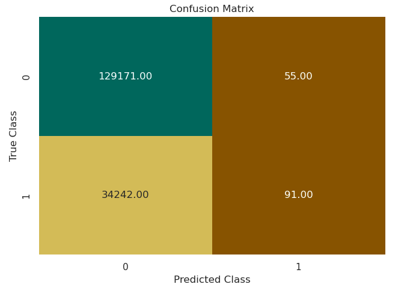
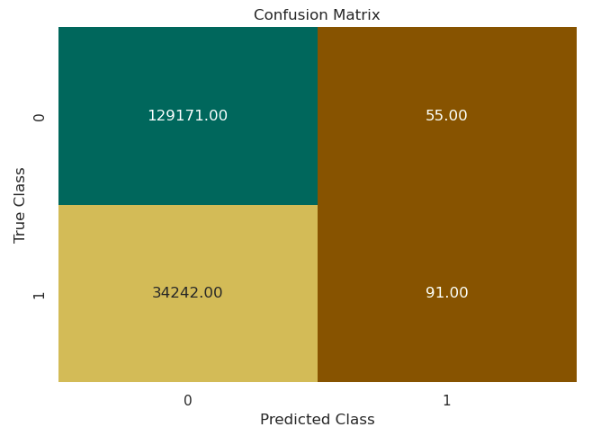
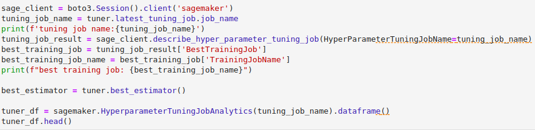

# Module 3 - Challenge Lab

## Introduction

The Challenge Lab in Module 3 is a recollection of all the previous Sections in the Module.
According to the Lab's introduction:

> You work for a travel booking website that wants to improve the customer experience for flights that were delayed.
> The company wants to create a feature to let customers know if the flight will be delayed because of weather when they book a flight to or from the busiest airports for domestic travel in the US.

> You are tasked with solving part of this problem by using machine learning (ML) to identify whether the flight will be delayed because of weather.
> You have been given access to the a dataset about the on-time performance of domestic flights that were operated by large air carriers.
> You can use this data to train an ML model to predict if the flight is going to be delayed for the busiest airports.

According to the dataset description:

> This dataset contains scheduled and actual departure and arrival times reported by certified US air carriers that account for at least 1 percent of domestic scheduled passenger revenues.
> The data was collected by the U.S. Office of Airline Information, Bureau of Transportation Statistics (BTS).
> The dataset contains date, time, origin, destination, airline, distance, and delay status of flights for flights between 2013 and 2018.

> For more information about features in the dataset, see [On-time delay dataset features](https://www.transtats.bts.gov/Fields.asp).

## First Steps - Problem Formulation

The first step is about defining the business problem, why Machine Learning (ML) is a good solution, and how to make it work.

## Data Collection and Labelling

The second step of creating an ML Model is to collect and label your data.
The first thing to do is to get the datasets to be able to examine them.

We can then read a bit about the background of the dataset to better understand the data it contains.

Once this is done, we can start inspecting the data, looking at the number of columns, their names and the data types they contain.

We proceed with several actions and verifications on the data, looking at the number of rows, columns, their contents, sorting it and grouping it for better view, etc.

We can then combine our csv files to get the full data.

Then, we select the columns that are of interest to us.

Now we change the column name we are looking for to better understand it.

We now check for null values and remove them.

## Data Evaluation

We now have our files combined and the amount of data reduced.
To make inspection easier, we can use plots to read our data.
First, let's see the distribution between delayed flights and not delayed flights.

Here we can clearly see we have a vast majority of not delayed flights in our data.
Let's now see the repartition depending on several other features in our data.

Here we can see several things:
* There seems to be more delayed flights than usual during summer.
* Most delays flights happen during evening, near 8pm.
* Distance and other features do not seem to correlate with delays.

## Feature Engineering

Now we have a better idea of what kind of data we are working with.
We can then start selecting our columns a bit better and change text data into numeric data.

Getting dummies makes sure our repeated text data such as Airports are made into numeric values without prioritizing any of it.

We can now rename `is_delay` into `target` for treatment simplicity.

## Model Training and Evaluation

We now have exploitable data.
Let's make use of it.

### First Model

First, we have to split our data, 80% for training, 10% for testing and 10% for validation.
We can use split_data for it.

We can now create a classification model and three different records for training, testing and validating it.

We can now train our classifier.

Training takes quite some time, but once it is done, we can get the metrics from it.

We can now test our model on testing data.

Once again, it takes some time, but once it is done, we can see our model efficiency on a confusion plot.

As we can see, the model predicted a huge number of False Negatives, flights that were predicted as not delayed but actually were.
This is a problem, as we want to be able to notify people if their flight will be delayed.

Let's try to tune things and make it right.

### Second Model

Our second model will be based on the hypothesis that there is more delayed flights during holidays and that weather can delay a flight as well.

First, let's add the holidays as a column in our data.

Second, let's add the weather into our dataset as well.

Now let's try again.

Now we test our model and check our plot.

Are you disappointed ? Because I am. Either we did something wrong, or it didn't affect our model at all.

Maybe we can try something else.
Let's try a new model.

### XGBoost Model

That's it, this time we're trying the same thing with an XGBoost Model.

First, let's put our data into csv files and open the channels.

We can now Create and train our XGB Model.

Now, our confusion plot should look better, right ?

Well, at least now we have more False Positives, which is better since we can notify our users of more issues.
But it might not be the best results yet. Let's try to play around a bit.

### Best Model

In this final part, we will be tuning the hyper parameters of our model.

First, let's create a tuning job.

This is the longest part of this Lab, it can take approximately 45 minutes.

Once it is done, we can get the classifier that got the best results, train it and test it again.

Now, this time, we should get the best results possible.

Well. Let's say it is good enough, taking into account the total number of rows in our data.
We still have a lot of False Positive, but it actually represents 26% of the data.
If needed, we can also change the thresholds, but it doesn't change much.

## Conclusion

To conclude this lab, we can say that the model does meet our business goal, but it could be better.
If we had more time for tuning, the goal would be to reduce False Positive values and get the most of True Positive values.

The model improved mostly when changing to an XGBoost model and after Hyper Parameters tuning.
Adding data didn't seem to have great effects on the model's results.

The biggest challenge we encountered during this Lab was mostly to wait between trainings and testings, and to understand the results we were seeing.

The pipeline is now way clearer than when we began the module and the Lab.

Three things we learned during this Lab were that:
* Model Tuning is not that easy, it depends on your data and Hyper Parameters and it can be difficult to read the results and adapt to them.
* Reading datasets requires to have knowledge about the business and how things works in the dataset's context, else it is hard to read the data and get what part of it is of importance to the business problem.
* Hyper Parameters Tuning can have really huge effects on your model's results.