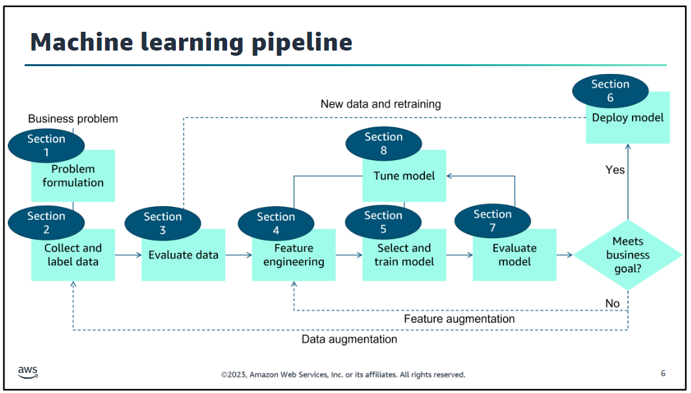

Sur ce schéma, on peut voir le pipeline du machine learning, différentes sections étapes ont été faite dans les labs.

## LAB 1

Création d'un notebook Jupyter avec Amazon SageMaker
Accès à la console de gestion AWS et création d'un notebook Jupyter.

Création de l'instance avec différents paramètres décrit dans le lab.
l'instance est dans la liste en pending, et lancé le jupiterlab une fois en marche.

Découverte de jupyterlab avec toutes les options disponibles sur les fichiers

Import de données depuis un site externes dans un nouveau notebook depuis un morceau de code.

## LAB 2

Dans le lab 2, l'objectif était de parcourir les données que l'on avait en amont.
Pour cela, j'ai utilisé Pandas qui est une bibliotheque python pour travailler les données avec les dataframes. (structure de données, tables, rubriques...)

Avec ceci on prépare donc les données pour le machine learning.

## LAB 3

Une fois les données parcourues, il faut les trier pour les formater et qu'elles soit compatibles entres elles et du même type.

## LAB 4

Ici, on divise les données en trois parties entraînement, validation et test
Utilisation de XGBoost: est un algorithme pour le machine learning

## LAB 5

Le modèle est entraîné en ajustant le modèle avec les hyperparametres
Prédiction sur des exemples en fonction des données.
Ajuste le seuil de probabilité pour avoir un maximum de précision.

## LAB 6

Dans le lab, nous avons utiliser les données de test pour générer des prédictions
Génerer des matrices à partir de résultats.

## LAB 7

On a testé notre modèle et optimisé avec sageMaker les performances du modèle.